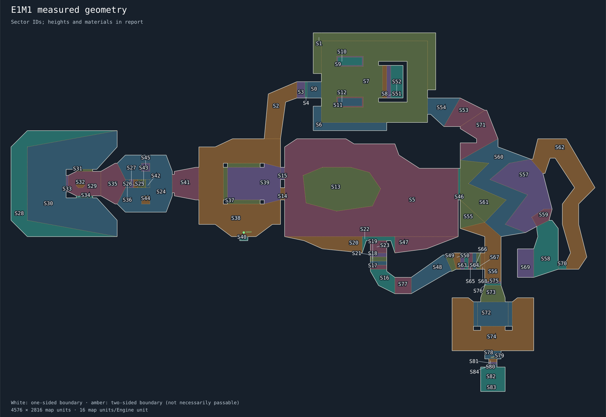

# E1M1 geometry scan

Generated measurements and tentative interpretations. Edit recipe.refined.json; this report is regenerated.

## Selected regions

| Sector | Floor / ceiling | Floor material | Boundary loops |
|---|---|---|---|
| 0 | 0 / 72 | FLOOR4_8 | 1 |
| 1 | 32 / 88 | FLAT18 | 1 |
| 2 | 0 / 144 | FLOOR4_8 | 1 |
| 3 | 0 / 88 | FLOOR4_8 | 1 |
| 4 | 0 / 0 | FLOOR4_8 | 1 |
| 5 | -56 / 216 | FLOOR7_1 | 2 |
| 6 | 32 / 88 | FLAT18 | 1 |
| 7 | 0 / 224 | FLOOR4_8 | 4 |
| 8 | 8 / 152 | FLAT14 | 1 |
| 9 | 0 / 224 | FLOOR4_8 | 2 |
| 10 | 0 / 96 | FLOOR4_8 | 1 |
| 11 | 0 / 224 | FLOOR4_8 | 2 |
| 12 | 0 / 96 | FLOOR4_8 | 1 |
| 13 | -80 / 216 | NUKAGE3 | 1 |
| 14 | 8 / 192 | FLAT5_5 | 1 |
| 15 | 8 / 192 | FLAT5_5 | 1 |
| 16 | -136 / -40 | FLOOR5_1 | 1 |
| 17 | -120 / 16 | FLOOR5_1 | 1 |
| 18 | -104 / 16 | FLOOR5_1 | 1 |
| 19 | -88 / 16 | FLOOR5_1 | 1 |
| 20 | -56 / 24 | FLOOR7_1 | 1 |
| 21 | -72 / 16 | FLOOR5_1 | 1 |
| 22 | -56 / 64 | FLOOR7_1 | 1 |
| 23 | -56 / 16 | FLOOR7_1 | 1 |
| 24 | -8 / 224 | FLOOR4_8 | 3 |
| 25 | 40 / 224 | FLOOR4_8 | 1 |
| 26 | 56 / 224 | FLOOR4_8 | 1 |
| 27 | 72 / 224 | FLOOR4_8 | 1 |
| 28 | 0 / 128 | FLOOR7_1 | 1 |
| 29 | 104 / 264 | FLOOR4_8 | 2 |
| 30 | 0 / 264 | FLOOR7_1 | 1 |
| 31 | 136 / 240 | FLAT20 | 1 |
| 32 | 128 / 264 | FLOOR1_1 | 1 |
| 33 | 136 / 240 | FLAT20 | 1 |
| 34 | 136 / 240 | FLAT20 | 1 |
| 35 | 104 / 192 | FLOOR4_8 | 1 |
| 36 | 88 / 224 | FLOOR4_8 | 1 |
| 37 | -8 / 120 | FLAT14 | 3 |
| 38 | 0 / 72 | FLOOR4_8 | 1 |
| 39 | -16 / 200 | FLAT14 | 1 |
| 40 | 0 / 72 | FLOOR4_8 | 1 |
| 41 | -8 / 120 | FLOOR4_8 | 1 |
| 42 | 8 / 224 | FLOOR4_8 | 1 |
| 43 | 24 / 224 | FLOOR4_8 | 1 |
| 44 | 40 / 184 | STEP2 | 1 |
| 45 | 40 / 184 | STEP2 | 1 |
| 46 | 0 / 136 | FLAT20 | 1 |
| 47 | -56 / 24 | FLOOR7_1 | 1 |
| 48 | -136 / -40 | FLOOR5_1 | 1 |
| 49 | -120 / 48 | FLOOR5_1 | 1 |
| 50 | -104 / 48 | FLOOR5_1 | 1 |
| 51 | 16 / 152 | FLAT14 | 1 |
| 52 | 24 / 152 | FLAT14 | 1 |
| 53 | -16 / 72 | FLOOR4_8 | 1 |
| 54 | -8 / 72 | FLOOR4_8 | 1 |
| 55 | -48 / 176 | NUKAGE3 | 1 |
| 56 | -24 / 176 | FLOOR5_2 | 1 |
| 57 | -48 / 176 | NUKAGE3 | 1 |
| 58 | -48 / 104 | FLOOR4_8 | 1 |
| 59 | 96 / 176 | FLOOR4_8 | 1 |
| 60 | -24 / 176 | FLOOR5_2 | 1 |
| 61 | -48 / 176 | NUKAGE3 | 1 |
| 62 | 104 / 184 | FLOOR4_8 | 1 |
| 63 | -88 / 48 | FLOOR5_1 | 1 |
| 64 | -72 / 48 | FLOOR5_1 | 1 |
| 65 | -56 / 48 | FLOOR5_1 | 1 |
| 66 | -40 / 48 | FLOOR5_1 | 1 |
| 67 | -24 / 48 | FLOOR5_2 | 1 |
| 68 | -24 / -24 | FLOOR5_2 | 1 |
| 69 | -48 / 32 | FLOOR4_8 | 1 |
| 70 | 104 / 184 | FLOOR4_8 | 1 |
| 71 | -24 / 176 | FLOOR5_2 | 1 |
| 72 | -24 / 104 | FLOOR5_2 | 1 |
| 73 | -24 / 48 | FLOOR5_2 | 1 |
| 74 | -24 / 48 | FLOOR5_2 | 1 |
| 75 | -24 / 48 | FLOOR5_2 | 1 |
| 76 | -24 / -24 | FLOOR5_2 | 1 |
| 77 | -136 / -24 | FLOOR5_1 | 1 |
| 78 | -24 / 72 | FLOOR5_2 | 2 |
| 79 | -24 / 56 | FLOOR5_2 | 1 |
| 80 | -24 / 48 | FLOOR5_2 | 1 |
| 81 | -24 / -24 | FLOOR5_2 | 1 |
| 82 | -24 / 88 | FLOOR5_2 | 2 |
| 83 | -24 / 72 | FLOOR5_2 | 1 |
| 84 | -24 / 48 | FLOOR5_2 | 1 |

## Suggested features

- **region-0**: floor-and-ceiling-region; sectors 0; lines 152, 157, 158, 384. measured footprint; architectural role unresolved.
- **region-1**: floor-and-ceiling-region; sectors 1; lines 360, 361, 363, 364, 366, 367, 368, 369, 370, 371, 372, 373. measured footprint; architectural role unresolved.
- **region-2**: floor-and-ceiling-region; sectors 2; lines 145, 146, 147, 148, 149, 150. measured footprint; architectural role unresolved.
- **region-3**: floor-and-ceiling-region; sectors 3; lines 150, 151, 153, 154. measured footprint; architectural role unresolved.
- **region-4**: floor-and-ceiling-region; sectors 4; lines 151, 152, 155, 156. measured footprint; architectural role unresolved.
- **region-5**: floor-and-ceiling-region; sectors 5; lines 30, 31, 36, 37, 38, 45, 46, 162, 163, 164, 165, 166, 167, 168, 169, 170, 171, 179, 250, 251, 252, 271, 272, 273, 276. measured footprint; architectural role unresolved.
- **region-6**: floor-and-ceiling-region; sectors 6; lines 362, 365, 374, 375, 376, 377, 378, 379. measured footprint; architectural role unresolved.
- **region-7**: floor-and-ceiling-region; sectors 7; lines 371, 372, 373, 378, 379, 380, 384, 385, 390, 391, 392, 393, 394, 395, 396, 397, 398, 399, 400, 401, 402, 410, 411, 412, 419, 420, 421, 422, 423, 424, 425, 426. measured footprint; architectural role unresolved.
- **region-8**: floor-and-ceiling-region; sectors 8; lines 403, 409, 412, 413. measured footprint; architectural role unresolved.
- **region-9**: floor-and-ceiling-region; sectors 9; lines 386, 387, 388, 389, 423, 424, 425, 426. measured footprint; architectural role unresolved.
- **region-10**: floor-and-ceiling-region; sectors 10; lines 386, 387, 388, 389. measured footprint; architectural role unresolved.
- **region-11**: floor-and-ceiling-region; sectors 11; lines 415, 416, 417, 418, 419, 420, 421, 422. measured footprint; architectural role unresolved.
- **region-12**: floor-and-ceiling-region; sectors 12; lines 415, 416, 417, 418. measured footprint; architectural role unresolved.
- **region-13**: floor-and-ceiling-region; sectors 13; lines 164, 165, 166, 167, 168, 169, 170, 171. measured footprint; architectural role unresolved.
- **region-14**: floor-and-ceiling-region; sectors 14; lines 26, 31, 32, 33. measured footprint; architectural role unresolved.
- **region-15**: floor-and-ceiling-region; sectors 15; lines 29, 30, 34, 35. measured footprint; architectural role unresolved.
- **region-16**: floor-and-ceiling-region; sectors 16; lines 215, 221, 222, 259, 260, 261, 262. measured footprint; architectural role unresolved.
- **region-17**: floor-and-ceiling-region; sectors 17; lines 212, 214, 220, 221. measured footprint; architectural role unresolved.
- **region-18**: floor-and-ceiling-region; sectors 18; lines 211, 213, 219, 220. measured footprint; architectural role unresolved.
- **region-19**: floor-and-ceiling-region; sectors 19; lines 208, 210, 218, 219. measured footprint; architectural role unresolved.
- **region-20**: floor-and-ceiling-region; sectors 20; lines 47, 48, 161, 252, 253. measured footprint; architectural role unresolved.
- **region-21**: floor-and-ceiling-region; sectors 21; lines 207, 209, 217, 218. measured footprint; architectural role unresolved.
- **region-22**: floor-and-ceiling-region; sectors 22; lines 203, 204, 205, 206, 216, 251, 253, 254. measured footprint; architectural role unresolved.
- **region-23**: floor-and-ceiling-region; sectors 23; lines 216, 217, 446, 447, 448, 449. measured footprint; architectural role unresolved.
- **region-24**: floor-and-ceiling-region; sectors 24; lines 64, 67, 68, 69, 70, 71, 72, 73, 74, 75, 76, 77, 78, 79, 80, 81, 82, 83, 84, 85, 92, 93, 94, 95, 137, 138, 139, 140, 141, 142, 143, 144. measured footprint; architectural role unresolved.
- **region-25**: floor-and-ceiling-region; sectors 25; lines 76, 82, 88, 89. measured footprint; architectural role unresolved.
- **region-26**: floor-and-ceiling-region; sectors 26; lines 75, 83, 87, 88. measured footprint; architectural role unresolved.
- **region-27**: floor-and-ceiling-region; sectors 27; lines 74, 84, 86, 87. measured footprint; architectural role unresolved.
- **region-28**: floor-and-ceiling-region; sectors 28; lines 125, 126, 127, 128, 129, 130, 131, 132. measured footprint; architectural role unresolved.
- **region-29**: floor-and-ceiling-region; sectors 29; lines 100, 101, 116, 117, 119, 121, 133, 134, 135, 136, 352, 353, 354, 355, 356, 357, 358, 359. measured footprint; architectural role unresolved.
- **region-30**: floor-and-ceiling-region; sectors 30; lines 108, 109, 110, 111, 112, 113, 114, 115, 118, 120, 122, 123, 124, 130, 131, 132. measured footprint; architectural role unresolved.
- **region-31**: floor-and-ceiling-region; sectors 31; lines 102, 103, 119, 120. measured footprint; architectural role unresolved.
- **region-32**: floor-and-ceiling-region; sectors 32; lines 352, 353, 354, 355, 356, 357, 358, 359. measured footprint; architectural role unresolved.
- **region-33**: floor-and-ceiling-region; sectors 33; lines 106, 107, 121, 122. measured footprint; architectural role unresolved.
- **region-34**: floor-and-ceiling-region; sectors 34; lines 104, 105, 117, 118. measured footprint; architectural role unresolved.
- **region-35**: floor-and-ceiling-region; sectors 35; lines 91, 92, 95, 96, 97, 98, 99, 116. measured footprint; architectural role unresolved.
- **region-36**: floor-and-ceiling-region; sectors 36; lines 73, 85, 86, 91. measured footprint; architectural role unresolved.
- **region-37**: floor-and-ceiling-region; sectors 37; lines 10, 11, 16, 18, 19, 22, 39, 50, 51, 52, 53, 54. measured footprint; architectural role unresolved.
- **region-38**: floor-and-ceiling-region; sectors 38; lines 3, 4, 5, 6, 7, 8, 9, 12, 13, 17, 20, 21, 25, 28, 39, 40, 41, 42, 43, 44, 49, 53, 54, 55, 56, 57, 149. measured footprint; architectural role unresolved.
- **region-39**: floor-and-ceiling-region; sectors 39; lines 14, 15, 23, 24, 26, 27, 29, 40, 41, 50, 51, 52. measured footprint; architectural role unresolved.
- **region-40**: floor-and-ceiling-region; sectors 40; lines 0, 1, 2, 49. measured footprint; architectural role unresolved.
- **region-41**: floor-and-ceiling-region; sectors 41; lines 57, 58, 59, 60, 61, 62, 63, 64, 65, 66. measured footprint; architectural role unresolved.
- **region-42**: floor-and-ceiling-region; sectors 42; lines 78, 79, 80, 90. measured footprint; architectural role unresolved.
- **region-43**: floor-and-ceiling-region; sectors 43; lines 77, 81, 89, 90. measured footprint; architectural role unresolved.
- **region-44**: floor-and-ceiling-region; sectors 44; lines 141, 142, 143, 144. measured footprint; architectural role unresolved.
- **region-45**: floor-and-ceiling-region; sectors 45; lines 137, 138, 139, 140. measured footprint; architectural role unresolved.
- **region-46**: floor-and-ceiling-region; sectors 46; lines 180, 274, 275, 276. measured footprint; architectural role unresolved.
- **region-47**: floor-and-ceiling-region; sectors 47; lines 159, 160, 250, 254. measured footprint; architectural role unresolved.
- **region-48**: floor-and-ceiling-region; sectors 48; lines 223, 230, 255, 256, 257, 258. measured footprint; architectural role unresolved.
- **region-49**: floor-and-ceiling-region; sectors 49; lines 229, 230, 231, 232. measured footprint; architectural role unresolved.
- **region-50**: floor-and-ceiling-region; sectors 50; lines 228, 229, 233, 242. measured footprint; architectural role unresolved.
- **region-51**: floor-and-ceiling-region; sectors 51; lines 404, 408, 413, 414. measured footprint; architectural role unresolved.
- **region-52**: floor-and-ceiling-region; sectors 52; lines 405, 406, 407, 414. measured footprint; architectural role unresolved.
- **region-53**: floor-and-ceiling-region; sectors 53; lines 172, 174, 192, 427. measured footprint; architectural role unresolved.
- **region-54**: floor-and-ceiling-region; sectors 54; lines 173, 381, 382, 383, 385, 427. measured footprint; architectural role unresolved.
- **region-55**: floor-and-ceiling-region; sectors 55; lines 178, 193, 196. measured footprint; architectural role unresolved.
- **region-56**: floor-and-ceiling-region; sectors 56; lines 189, 190, 191, 194, 196, 247, 249, 310. measured footprint; architectural role unresolved.
- **region-57**: floor-and-ceiling-region; sectors 57; lines 182, 185, 187, 197, 198, 199, 200, 201, 202, 268, 464. measured footprint; architectural role unresolved.
- **region-58**: floor-and-ceiling-region; sectors 58; lines 270, 428, 430, 431, 432, 433, 434, 435, 450, 465. measured footprint; architectural role unresolved.
- **region-59**: floor-and-ceiling-region; sectors 59; lines 200, 201, 202, 269, 270. measured footprint; architectural role unresolved.
- **region-60**: floor-and-ceiling-region; sectors 60; lines 176, 181, 182, 183, 184, 185, 186, 187, 188, 194, 195, 197, 198, 263. measured footprint; architectural role unresolved.
- **region-61**: floor-and-ceiling-region; sectors 61; lines 183, 184, 186, 193, 263, 275, 277. measured footprint; architectural role unresolved.
- **region-62**: floor-and-ceiling-region; sectors 62; lines 451, 452, 453, 454, 455, 456, 457, 458, 459, 460, 461, 462, 463, 464, 466, 467, 468, 469, 470. measured footprint; architectural role unresolved.
- **region-63**: floor-and-ceiling-region; sectors 63; lines 227, 228, 234, 241. measured footprint; architectural role unresolved.
- **region-64**: floor-and-ceiling-region; sectors 64; lines 226, 227, 235, 240. measured footprint; architectural role unresolved.
- **region-65**: floor-and-ceiling-region; sectors 65; lines 225, 226, 236, 239. measured footprint; architectural role unresolved.
- **region-66**: floor-and-ceiling-region; sectors 66; lines 224, 225, 237, 238. measured footprint; architectural role unresolved.
- **region-67**: floor-and-ceiling-region; sectors 67; lines 224, 243, 244, 248. measured footprint; architectural role unresolved.
- **region-68**: floor-and-ceiling-region; sectors 68; lines 245, 246, 247, 248. measured footprint; architectural role unresolved.
- **region-69**: floor-and-ceiling-region; sectors 69; lines 429, 431, 436, 437, 438, 439. measured footprint; architectural role unresolved.
- **region-70**: floor-and-ceiling-region; sectors 70; lines 465, 466, 471, 472, 473, 474. measured footprint; architectural role unresolved.
- **region-71**: floor-and-ceiling-region; sectors 71; lines 175, 177, 192, 195, 264, 265, 266, 267, 351. measured footprint; architectural role unresolved.
- **region-72**: floor-and-ceiling-region; sectors 72; lines 290, 291, 292, 293, 294, 295, 296, 297, 308, 309, 313, 314. measured footprint; architectural role unresolved.
- **region-73**: floor-and-ceiling-region; sectors 73; lines 281, 282, 308, 336, 339, 341. measured footprint; architectural role unresolved.
- **region-74**: floor-and-ceiling-region; sectors 74; lines 278, 279, 280, 283, 284, 285, 286, 287, 288, 289, 304, 305, 309, 311, 312, 313, 314, 315. measured footprint; architectural role unresolved.
- **region-75**: floor-and-ceiling-region; sectors 75; lines 310, 334, 335, 340. measured footprint; architectural role unresolved.
- **region-76**: floor-and-ceiling-region; sectors 76; lines 337, 338, 340, 341. measured footprint; architectural role unresolved.
- **region-77**: floor-and-ceiling-region; sectors 77; lines 222, 223, 440, 441, 442, 443, 444, 445. measured footprint; architectural role unresolved.
- **region-78**: floor-and-ceiling-region; sectors 78; lines 306, 307, 315, 316, 317, 342, 343, 344, 345, 346. measured footprint; architectural role unresolved.
- **region-79**: floor-and-ceiling-region; sectors 79; lines 342, 343, 344, 345. measured footprint; architectural role unresolved.
- **region-80**: floor-and-ceiling-region; sectors 80; lines 318, 319, 325, 346. measured footprint; architectural role unresolved.
- **region-81**: floor-and-ceiling-region; sectors 81; lines 320, 323, 324, 325. measured footprint; architectural role unresolved.
- **region-82**: floor-and-ceiling-region; sectors 82; lines 326, 327, 328, 329, 330, 331, 332, 333, 347, 348, 349, 350. measured footprint; architectural role unresolved.
- **region-83**: floor-and-ceiling-region; sectors 83; lines 347, 348, 349, 350. measured footprint; architectural role unresolved.
- **region-84**: floor-and-ceiling-region; sectors 84; lines 321, 322, 324, 333. measured footprint; architectural role unresolved.
- **boundary-26**: step-or-ledge-candidate; sectors 39, 14; lines 26. tentative.
- **boundary-29**: step-or-ledge-candidate; sectors 39, 15; lines 29. tentative.
- **boundary-30**: step-or-ledge-candidate; sectors 5, 15; lines 30. tentative.
- **boundary-31**: step-or-ledge-candidate; sectors 5, 14; lines 31. tentative.
- **boundary-39**: step-or-ledge-candidate; sectors 37, 38; lines 39. tentative.
- **boundary-40**: step-or-ledge-candidate; sectors 39, 38; lines 40. tentative.
- **boundary-41**: step-or-ledge-candidate; sectors 39, 38; lines 41. tentative.
- **boundary-49**: opening-candidate; sectors 38, 40; lines 49. tentative.
- **boundary-50**: step-or-ledge-candidate; sectors 39, 37; lines 50. tentative.
- **boundary-51**: step-or-ledge-candidate; sectors 39, 37; lines 51. tentative.
- **boundary-52**: step-or-ledge-candidate; sectors 39, 37; lines 52. tentative.
- **boundary-53**: step-or-ledge-candidate; sectors 37, 38; lines 53. tentative.
- **boundary-54**: step-or-ledge-candidate; sectors 37, 38; lines 54. tentative.
- **boundary-57**: step-or-ledge-candidate; sectors 41, 38; lines 57. tentative.
- **boundary-73**: step-or-ledge-candidate; sectors 24, 36; lines 73. tentative.
- **boundary-74**: step-or-ledge-candidate; sectors 24, 27; lines 74. tentative.
- **boundary-75**: step-or-ledge-candidate; sectors 24, 26; lines 75. tentative.
- **boundary-76**: step-or-ledge-candidate; sectors 24, 25; lines 76. tentative.
- **boundary-77**: step-or-ledge-candidate; sectors 24, 43; lines 77. tentative.
- **boundary-78**: step-or-ledge-candidate; sectors 24, 42; lines 78. tentative.
- **boundary-79**: step-or-ledge-candidate; sectors 24, 42; lines 79. tentative.
- **boundary-80**: step-or-ledge-candidate; sectors 24, 42; lines 80. tentative.
- **boundary-81**: step-or-ledge-candidate; sectors 24, 43; lines 81. tentative.
- **boundary-82**: step-or-ledge-candidate; sectors 24, 25; lines 82. tentative.
- **boundary-83**: step-or-ledge-candidate; sectors 24, 26; lines 83. tentative.
- **boundary-84**: step-or-ledge-candidate; sectors 24, 27; lines 84. tentative.
- **boundary-85**: step-or-ledge-candidate; sectors 24, 36; lines 85. tentative.
- **boundary-86**: step-or-ledge-candidate; sectors 27, 36; lines 86. tentative.
- **boundary-87**: step-or-ledge-candidate; sectors 26, 27; lines 87. tentative.
- **boundary-88**: step-or-ledge-candidate; sectors 25, 26; lines 88. tentative.
- **boundary-89**: step-or-ledge-candidate; sectors 43, 25; lines 89. tentative.
- **boundary-90**: step-or-ledge-candidate; sectors 42, 43; lines 90. tentative.
- **boundary-91**: step-or-ledge-candidate; sectors 36, 35; lines 91. tentative.
- **boundary-92**: step-or-ledge-candidate; sectors 24, 35; lines 92. tentative.
- **boundary-95**: step-or-ledge-candidate; sectors 24, 35; lines 95. tentative.
- **boundary-117**: step-or-ledge-candidate; sectors 29, 34; lines 117. tentative.
- **boundary-118**: step-or-ledge-candidate; sectors 30, 34; lines 118. tentative.
- **boundary-119**: step-or-ledge-candidate; sectors 29, 31; lines 119. tentative.
- **boundary-120**: step-or-ledge-candidate; sectors 30, 31; lines 120. tentative.
- **boundary-121**: step-or-ledge-candidate; sectors 29, 33; lines 121. tentative.
- **boundary-122**: step-or-ledge-candidate; sectors 30, 33; lines 122. tentative.
- **boundary-137**: step-or-ledge-candidate; sectors 24, 45; lines 137. tentative.
- **boundary-138**: step-or-ledge-candidate; sectors 24, 45; lines 138. tentative.
- **boundary-139**: step-or-ledge-candidate; sectors 24, 45; lines 139. tentative.
- **boundary-140**: step-or-ledge-candidate; sectors 24, 45; lines 140. tentative.
- **boundary-141**: step-or-ledge-candidate; sectors 24, 44; lines 141. tentative.
- **boundary-142**: step-or-ledge-candidate; sectors 24, 44; lines 142. tentative.
- **boundary-143**: step-or-ledge-candidate; sectors 24, 44; lines 143. tentative.
- **boundary-144**: step-or-ledge-candidate; sectors 24, 44; lines 144. tentative.
- **boundary-149**: opening-candidate; sectors 2, 38; lines 149. tentative.
- **boundary-150**: opening-candidate; sectors 2, 3; lines 150. tentative.
- **boundary-151**: opening-candidate; sectors 3, 4; lines 151. tentative.
- **boundary-152**: opening-candidate; sectors 0, 4; lines 152. tentative.
- **boundary-164**: step-or-ledge-candidate; sectors 13, 5; lines 164. tentative.
- **boundary-165**: step-or-ledge-candidate; sectors 13, 5; lines 165. tentative.
- **boundary-166**: step-or-ledge-candidate; sectors 13, 5; lines 166. tentative.
- **boundary-167**: step-or-ledge-candidate; sectors 13, 5; lines 167. tentative.
- **boundary-168**: step-or-ledge-candidate; sectors 13, 5; lines 168. tentative.
- **boundary-169**: step-or-ledge-candidate; sectors 13, 5; lines 169. tentative.
- **boundary-170**: step-or-ledge-candidate; sectors 13, 5; lines 170. tentative.
- **boundary-171**: step-or-ledge-candidate; sectors 13, 5; lines 171. tentative.
- **boundary-182**: step-or-ledge-candidate; sectors 57, 60; lines 182. tentative.
- **boundary-183**: step-or-ledge-candidate; sectors 61, 60; lines 183. tentative.
- **boundary-184**: step-or-ledge-candidate; sectors 61, 60; lines 184. tentative.
- **boundary-185**: step-or-ledge-candidate; sectors 57, 60; lines 185. tentative.
- **boundary-186**: step-or-ledge-candidate; sectors 61, 60; lines 186. tentative.
- **boundary-187**: step-or-ledge-candidate; sectors 57, 60; lines 187. tentative.
- **boundary-192**: step-or-ledge-candidate; sectors 71, 53; lines 192. tentative.
- **boundary-196**: step-or-ledge-candidate; sectors 55, 56; lines 196. tentative.
- **boundary-197**: step-or-ledge-candidate; sectors 57, 60; lines 197. tentative.
- **boundary-198**: step-or-ledge-candidate; sectors 57, 60; lines 198. tentative.
- **boundary-200**: step-or-ledge-candidate; sectors 57, 59; lines 200. tentative.
- **boundary-201**: step-or-ledge-candidate; sectors 57, 59; lines 201. tentative.
- **boundary-202**: step-or-ledge-candidate; sectors 57, 59; lines 202. tentative.
- **boundary-216**: opening-candidate; sectors 22, 23; lines 216. tentative.
- **boundary-217**: step-or-ledge-candidate; sectors 21, 23; lines 217. tentative.
- **boundary-218**: step-or-ledge-candidate; sectors 19, 21; lines 218. tentative.
- **boundary-219**: step-or-ledge-candidate; sectors 18, 19; lines 219. tentative.
- **boundary-220**: step-or-ledge-candidate; sectors 17, 18; lines 220. tentative.
- **boundary-221**: step-or-ledge-candidate; sectors 16, 17; lines 221. tentative.
- **boundary-222**: opening-candidate; sectors 77, 16; lines 222. tentative.
- **boundary-223**: opening-candidate; sectors 77, 48; lines 223. tentative.
- **boundary-224**: step-or-ledge-candidate; sectors 66, 67; lines 224. tentative.
- **boundary-225**: step-or-ledge-candidate; sectors 65, 66; lines 225. tentative.
- **boundary-226**: step-or-ledge-candidate; sectors 64, 65; lines 226. tentative.
- **boundary-227**: step-or-ledge-candidate; sectors 63, 64; lines 227. tentative.
- **boundary-228**: step-or-ledge-candidate; sectors 50, 63; lines 228. tentative.
- **boundary-229**: step-or-ledge-candidate; sectors 49, 50; lines 229. tentative.
- **boundary-230**: step-or-ledge-candidate; sectors 48, 49; lines 230. tentative.
- **boundary-247**: opening-candidate; sectors 56, 68; lines 247. tentative.
- **boundary-248**: opening-candidate; sectors 67, 68; lines 248. tentative.
- **boundary-253**: opening-candidate; sectors 20, 22; lines 253. tentative.
- **boundary-254**: opening-candidate; sectors 47, 22; lines 254. tentative.
- **boundary-263**: step-or-ledge-candidate; sectors 61, 60; lines 263. tentative.
- **boundary-270**: step-or-ledge-candidate; sectors 59, 58; lines 270. tentative.
- **boundary-275**: step-or-ledge-candidate; sectors 61, 46; lines 275. tentative.
- **boundary-276**: step-or-ledge-candidate; sectors 5, 46; lines 276. tentative.
- **boundary-310**: opening-candidate; sectors 56, 75; lines 310. tentative.
- **boundary-315**: opening-candidate; sectors 78, 74; lines 315. tentative.
- **boundary-324**: opening-candidate; sectors 84, 81; lines 324. tentative.
- **boundary-325**: opening-candidate; sectors 80, 81; lines 325. tentative.
- **boundary-333**: opening-candidate; sectors 82, 84; lines 333. tentative.
- **boundary-340**: opening-candidate; sectors 75, 76; lines 340. tentative.
- **boundary-341**: opening-candidate; sectors 73, 76; lines 341. tentative.
- **boundary-342**: opening-candidate; sectors 78, 79; lines 342. tentative.
- **boundary-343**: opening-candidate; sectors 78, 79; lines 343. tentative.
- **boundary-344**: opening-candidate; sectors 78, 79; lines 344. tentative.
- **boundary-345**: opening-candidate; sectors 78, 79; lines 345. tentative.
- **boundary-346**: opening-candidate; sectors 78, 80; lines 346. tentative.
- **boundary-347**: opening-candidate; sectors 82, 83; lines 347. tentative.
- **boundary-348**: opening-candidate; sectors 82, 83; lines 348. tentative.
- **boundary-349**: opening-candidate; sectors 82, 83; lines 349. tentative.
- **boundary-350**: opening-candidate; sectors 82, 83; lines 350. tentative.
- **boundary-352**: step-or-ledge-candidate; sectors 29, 32; lines 352. tentative.
- **boundary-353**: step-or-ledge-candidate; sectors 29, 32; lines 353. tentative.
- **boundary-354**: step-or-ledge-candidate; sectors 29, 32; lines 354. tentative.
- **boundary-355**: step-or-ledge-candidate; sectors 29, 32; lines 355. tentative.
- **boundary-356**: step-or-ledge-candidate; sectors 29, 32; lines 356. tentative.
- **boundary-357**: step-or-ledge-candidate; sectors 29, 32; lines 357. tentative.
- **boundary-358**: step-or-ledge-candidate; sectors 29, 32; lines 358. tentative.
- **boundary-359**: step-or-ledge-candidate; sectors 29, 32; lines 359. tentative.
- **boundary-371**: step-or-ledge-candidate; sectors 7, 1; lines 371. tentative.
- **boundary-372**: step-or-ledge-candidate; sectors 7, 1; lines 372. tentative.
- **boundary-373**: step-or-ledge-candidate; sectors 7, 1; lines 373. tentative.
- **boundary-378**: step-or-ledge-candidate; sectors 7, 6; lines 378. tentative.
- **boundary-379**: step-or-ledge-candidate; sectors 7, 6; lines 379. tentative.
- **boundary-384**: opening-candidate; sectors 7, 0; lines 384. tentative.
- **boundary-385**: step-or-ledge-candidate; sectors 7, 54; lines 385. tentative.
- **boundary-386**: opening-candidate; sectors 9, 10; lines 386. tentative.
- **boundary-388**: opening-candidate; sectors 9, 10; lines 388. tentative.
- **boundary-412**: step-or-ledge-candidate; sectors 7, 8; lines 412. tentative.
- **boundary-413**: step-or-ledge-candidate; sectors 8, 51; lines 413. tentative.
- **boundary-414**: step-or-ledge-candidate; sectors 51, 52; lines 414. tentative.
- **boundary-415**: opening-candidate; sectors 11, 12; lines 415. tentative.
- **boundary-417**: opening-candidate; sectors 11, 12; lines 417. tentative.
- **boundary-420**: opening-candidate; sectors 7, 11; lines 420. tentative.
- **boundary-422**: opening-candidate; sectors 7, 11; lines 422. tentative.
- **boundary-424**: opening-candidate; sectors 7, 9; lines 424. tentative.
- **boundary-426**: opening-candidate; sectors 7, 9; lines 426. tentative.
- **boundary-427**: step-or-ledge-candidate; sectors 53, 54; lines 427. tentative.
- **boundary-464**: step-or-ledge-candidate; sectors 57, 62; lines 464. tentative.
- **boundary-465**: step-or-ledge-candidate; sectors 58, 70; lines 465. tentative.
- **boundary-466**: opening-candidate; sectors 70, 62; lines 466. tentative.
- **repeat-64x64**: repeated-small-boundary-candidate; sectors 24, 29, 32, 44, 45, 70; lines 137, 138, 139, 140, 141, 142, 143, 144, 352, 353, 354, 355, 356, 357, 358, 359, 352, 359, 358, 357, 356, 355, 354, 353, 141, 144, 143, 142, 137, 140, 139, 138, 465, 471, 472, 466, 473, 474. tentative; may be holes or decoration.
- **repeat-32x64**: repeated-small-boundary-candidate; sectors 25, 26, 27, 36, 42, 43; lines 76, 88, 82, 89, 75, 87, 83, 88, 74, 86, 84, 87, 73, 91, 85, 86, 78, 90, 80, 79, 77, 89, 81, 90. tentative; may be holes or decoration.
- **repeat-32x8**: repeated-small-boundary-candidate; sectors 78, 79, 82, 83; lines 342, 345, 343, 344, 342, 344, 343, 345, 347, 350, 348, 349, 347, 349, 348, 350. tentative; may be holes or decoration.
- **repeat-64x24**: repeated-small-boundary-candidate; sectors 80, 84; lines 318, 346, 319, 325, 321, 333, 322, 324. tentative; may be holes or decoration.

## Unresolved measurements

None.

Unresolved regions are not filled or labelled as polygons in the plan. Their measured boundary lines remain visible. Adjacent sectors are context only. Two-sided lines do not guarantee walkability; inspect flags, clearance, height changes and dynamic behavior.

Box fitting, stair grouping, moving-door behavior, UV layout and Engine mesh generation are intentionally manual in this first scanner. Suggestions are evidence for refinement, not executable or complete geometry.
