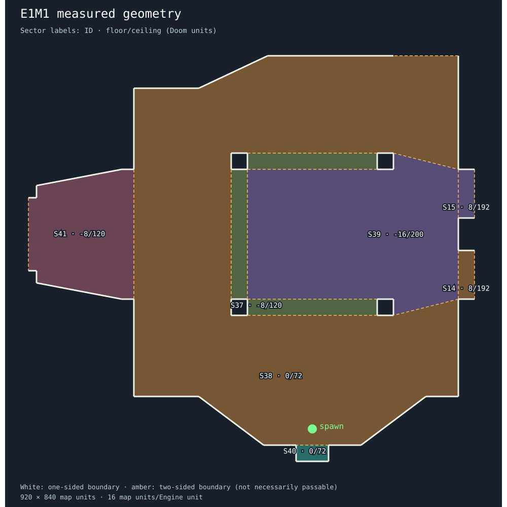

# E1M1 geometry scan

Generated measurements and tentative interpretations. Edit recipe.refined.json; this report is regenerated.

## Selected regions

| Sector | Floor / ceiling | Floor material | Boundary loops |
|---|---|---|---|
| 14 | 8 / 192 | FLAT5_5 | 1 |
| 15 | 8 / 192 | FLAT5_5 | 1 |
| 37 | -8 / 120 | FLAT14 | 3 |
| 38 | 0 / 72 | FLOOR4_8 | 1 |
| 39 | -16 / 200 | FLAT14 | 1 |
| 40 | 0 / 72 | FLOOR4_8 | 1 |
| 41 | -8 / 120 | FLOOR4_8 | 1 |

## Suggested features

- **region-14**: floor-and-ceiling-region; sectors 14; lines 26, 31, 32, 33. measured footprint; architectural role unresolved.
- **region-15**: floor-and-ceiling-region; sectors 15; lines 29, 30, 34, 35. measured footprint; architectural role unresolved.
- **region-37**: floor-and-ceiling-region; sectors 37; lines 10, 11, 16, 18, 19, 22, 39, 50, 51, 52, 53, 54. measured footprint; architectural role unresolved.
- **region-38**: floor-and-ceiling-region; sectors 38; lines 3, 4, 5, 6, 7, 8, 9, 12, 13, 17, 20, 21, 25, 28, 39, 40, 41, 42, 43, 44, 49, 53, 54, 55, 56, 57, 149. measured footprint; architectural role unresolved.
- **region-39**: floor-and-ceiling-region; sectors 39; lines 14, 15, 23, 24, 26, 27, 29, 40, 41, 50, 51, 52. measured footprint; architectural role unresolved.
- **region-40**: floor-and-ceiling-region; sectors 40; lines 0, 1, 2, 49. measured footprint; architectural role unresolved.
- **region-41**: floor-and-ceiling-region; sectors 41; lines 57, 58, 59, 60, 61, 62, 63, 64, 65, 66. measured footprint; architectural role unresolved.
- **boundary-26**: step-or-ledge-candidate; sectors 39, 14; lines 26. tentative.
- **boundary-29**: step-or-ledge-candidate; sectors 39, 15; lines 29. tentative.
- **boundary-30**: step-or-ledge-candidate; sectors 5, 15; lines 30. tentative.
- **boundary-31**: step-or-ledge-candidate; sectors 5, 14; lines 31. tentative.
- **boundary-39**: step-or-ledge-candidate; sectors 37, 38; lines 39. tentative.
- **boundary-40**: step-or-ledge-candidate; sectors 39, 38; lines 40. tentative.
- **boundary-41**: step-or-ledge-candidate; sectors 39, 38; lines 41. tentative.
- **boundary-49**: opening-candidate; sectors 38, 40; lines 49. tentative.
- **boundary-50**: step-or-ledge-candidate; sectors 39, 37; lines 50. tentative.
- **boundary-51**: step-or-ledge-candidate; sectors 39, 37; lines 51. tentative.
- **boundary-52**: step-or-ledge-candidate; sectors 39, 37; lines 52. tentative.
- **boundary-53**: step-or-ledge-candidate; sectors 37, 38; lines 53. tentative.
- **boundary-54**: step-or-ledge-candidate; sectors 37, 38; lines 54. tentative.
- **boundary-57**: step-or-ledge-candidate; sectors 41, 38; lines 57. tentative.
- **boundary-149**: opening-candidate; sectors 2, 38; lines 149. tentative.

## Unresolved measurements

None.

Unresolved regions are not filled or labelled as polygons in the plan. Their measured boundary lines remain visible. Adjacent sectors are context only. Two-sided lines do not guarantee walkability; inspect flags, clearance, height changes and dynamic behavior.

Box fitting, stair grouping, moving-door behavior, UV layout and Engine mesh generation are intentionally manual in this first scanner. Suggestions are evidence for refinement, not executable or complete geometry.
